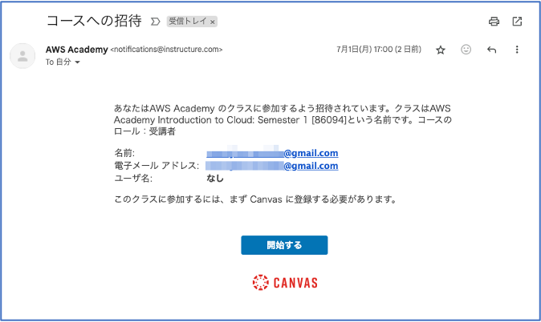
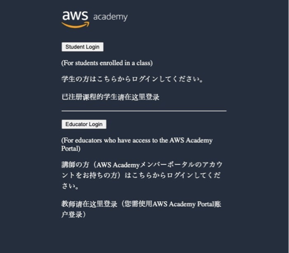
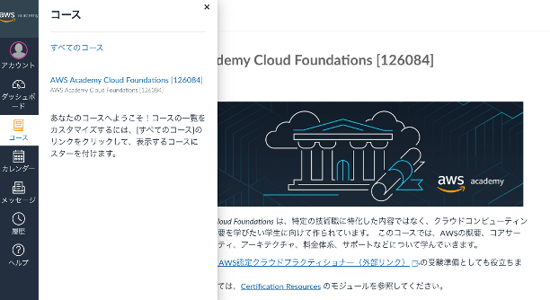
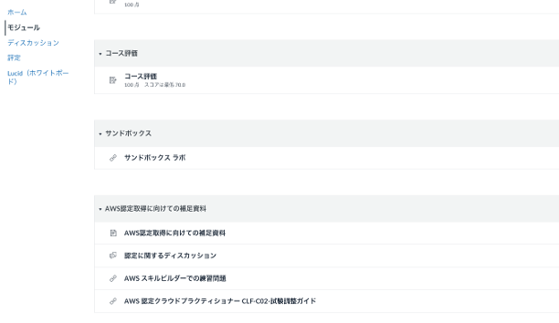
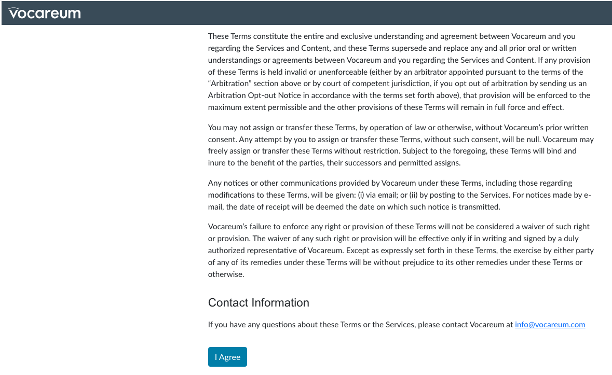
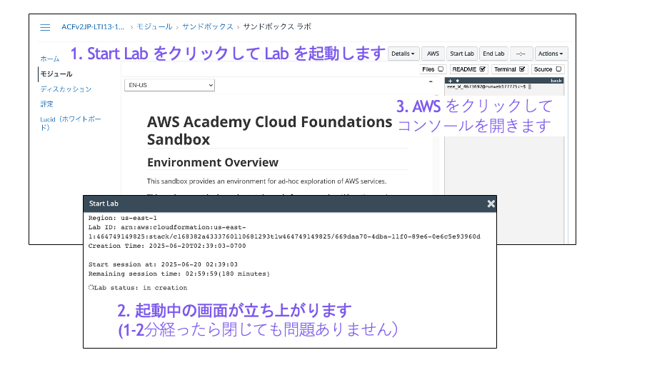
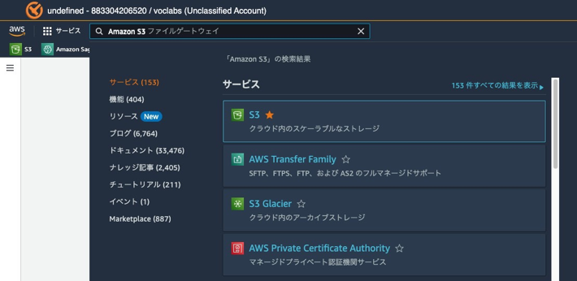

## 演習の目的

本コンテンツは神奈川大学 情報学部 情報リテラシー演習受講生向けに作られたページです。

本講義は AWS の学習環境 [AWS Academy](https://aws.amazon.com/jp/training/awsacademy/) を使ってクラウドの基本を演習を通して学ぶことを目的としています。情報学部の学生の多くが、ウェブサイトの作成と公開を初期段階で学ぶことから、それに沿った形で、AWS Academy の追加コンテンツとして独自に作成し
ています。 コンテンツに関する問い合わせは AWS Academy ではなく github の issue にて報告をお願いします。

## 演習の概要

クラウドオブジェクトストレージであるAmazon S3 に HTML ファイル (CSS ファイルもあれば含める) をアップロードして、ウェブサイトを公開します。
また、エッジサービスである Amazon CloudFront 経由でウェブサイトにアクセスします。

注意事項:
今回使用する環境は長期間利用できる環境ではないため、演習が完了したらスクリーンショットをとって結果を残しておいてください。
スクリーンショットはレポートの提出などで利用してください。


## AWS Academy のアカウント登録

学生が AWS Academy を利用するためにはアカウントを登録する必要があります。教員が受講生をコースに追加すると「コースへの招待」というメールが届くため、それに従って学生はアカウントを登録します。




## AWS Academy へのログイン

アカウント登録が終わったら、以下のページから AWS Academy へログインします。Student Login を選んでください。
https://www.awsacademy.com/vforcesite/LMS_Login

 

## コースの選択とモジュールの選択

左のメニューからコースを選択し、AWS Academy Cloud Foundations を選択します。



  
次にモジュールから 「サンドボックス ラボ」を選択します。




## AWS 環境の起動

初回は同意事項に関するページが表示されますので、一番下までスクロールして I Agree をクリックし、同意してください。



するとサンドボックスの説明画面が開きます。右上のメニューから Start Lab ボタンをクリックすると、Labをスタートすることができます。ボタンを押すと環境構築中の別画面が開きますが、1-2分たったら閉じて問題ありません。AWS ボタンを押すとAWS コンソールの画面を開くことができます。
もしAWSボタンを押してもAWSコンソール画面が開かない場合は、まだ環境構築中の可能性があるので、もう少し待ってみます。



## AWS コンソールの操作

### Amazon S3 

AWS コンソールが起動したら左上の検索ウィンドウに S3 とうって、Amazon S3 のサービスを検索します。



まず最初にバケットの作成を行います。これまでの利用状況に応じて、トップ画面に「バケットを作成」ボタンがあったり、左のメニューの「バケット」からバケット一覧にアクセスして、「バケットを作成」ボタンを確認できたりします。


バケット作成で最初の画面では、デフォルトのまま汎用バケットを選択し、バケット名を入力します。バケット名は世界で唯一の名前である必要があります。


次にバケットのパブリックアクセスのブロック設定を行います。Amazon S3のバケットはデフォルトで公開しない（公開しようとしてもブロックする）設定になっています。これは意図せず公開してしまい、情報が漏洩すること防ぐためです。
今回はWebページを公開する目的で利用するので、このブロック設定を解除します。あくまで、ブロックしないようにするだけなので、この段階で情報が公開されるわけではありません。**パブリックアクセスをすべてブロックをオフ**にして、**最後の確認のところにチェック**をいれてください。


最後に作成ボタンを押すとバケットを作成できます。バケットの一覧画面に戻ると作成したバケットを確認できるので、バケットの名前をクリックして詳細を確認します。


開いた画面の上部にタブが並んでいるので「アクセス許可」を選びます。ここでバケットを公開する設定を行います。


バケットを公開するかどうかは、そのバケットの取扱の詳細を決める**バケットポリシー**を設定することによって行います。したがって、上部画面から**バケットポリシー**の**編集**ボタンをクリックして、バケットポリシーを作成します。

編集画面を開くと何も書かれていない空のエディタが開くので、下の**バケットポリシーのテンプレート**をまずコピーします。その後、Resource の "ここにバケットARNをいれる" のところに、編集画面の上部にあるバケット ARN をコピーして貼り付けます。

このバケットポリシーの意味は、だれでも (Principal: *)、リソース (Resource": "バケットARN") からのダウンロード操作 ("Action": "s3:GetObject") を許可 ("Effect": "Allow") するという意味です。

終わったらバケットポリシーを保存してください。


**■ バケットポリシーのテンプレート**
```json
{
    "Version": "2012-10-17",
    "Statement": [
        {
        "Sid": "PublicReadForGetBucketObjects", 
        "Effect": "Allow",
        "Principal": "*",
        "Action": "s3:GetObject", 
        "Resource": "ここにバケットARNをいれる"
        }
    ]
}
```

公開したいファイル (HTML, CSSなど)をアップロードします。上のタブの**オブジェクト**から**アップロード**ボタンをクリックするとファイルアップロード画面になります。ここに HTML, CSS, 画像 などをアップロードします。


最後に静的ホスティングを有効にしてアクセスできるかどうか確認します。まず上部のタブから **プロパティ**を選択し、一番下の**静的ウェブサイトホスティング**の**編集**をクリックします。インデックスのドキュメントは最初に表示したいHTMLファイルを記載します。


ではアクセスしてみましょう。**プロパティ**から一番下の**静的ウェブサイトホスティング**の項目をチェックするとURLが掲載されています。URLをクリックして、先程指定したHTMLファイルが表示されたら成功です。

